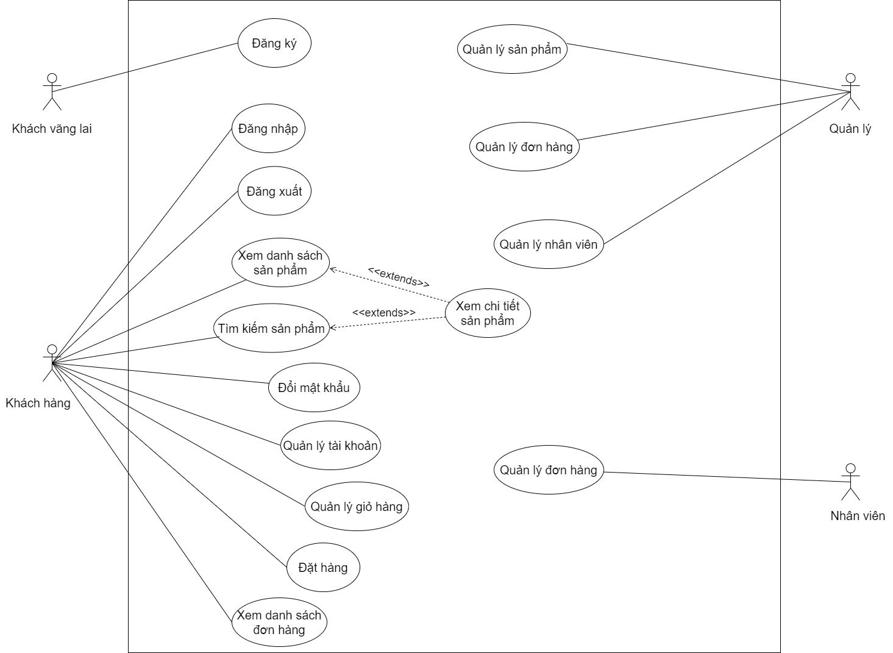
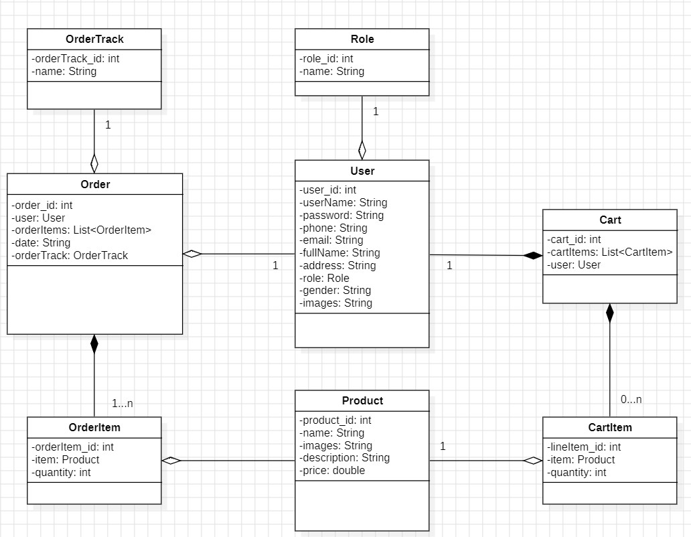

# Book Store APP

Final term project of the "Mobile Programming" course - Book Store APP.

## Table of Contents

1. [Use Case Diagram](#use-case-diagram)
1. [Class Diagram](#class-diagram)
1. [Prerequisites](#prerequisites)
1. [Installation](#installation)
1. [Running the Project](#running-the-project)
1. [Project Structure](#project-structure)
1. [Technology Stack](#technology-stack)
1. [Contributors](#contributors)
1. [Author](#author)
1. [License](#license)
1. [References](#references)

## Use Case Diagram



## Class Diagram



## Prerequisites

Before you begin, ensure you have met the following requirements:

- **Java Development Kit (JDK)**: Install Java Development Kit (JDK) 21 or higher. You can download it from [here](https://www.oracle.com/java/technologies/javase-downloads.html).
- **Android Studio**: Download and install the latest version of Android Studio from [here](https://developer.android.com/studio).
- **Git**: Install Git from [here](https://git-scm.com/).
- **Android Device**: Ensure you have an Android device running Android 5.0 (Lollipop) or higher.

## Installation

1. **Clone the project from the repository**:

    ```sh
    git clone https://github.com/nguyenkhanhquy/bookstore-app.git
    ```

1. **Open the project in Android Studio**:

    - Launch Android Studio.
    - Click on `File > Open`.
    - Navigate to the directory where you cloned the repository, select the project folder, and click `OK`.

1. **Install dependencies**:

    - Android Studio will automatically prompt you to install any necessary dependencies. Follow the on-screen instructions to complete the setup.

## Running the Project

1. **Connect an Android device (optional)**:

    - You can run the project on a physical device by connecting it via USB. Ensure that USB debugging is enabled on your device.
    - Alternatively, you can use an Android emulator.

1. **Build and run the project**:

    - Click on the `Run` button (green play arrow) in the toolbar, or use the shortcut `Shift + F10`.
    - Select the device or emulator you want to run the project on.
    - Android Studio will build the project and install the app on your selected device/emulator.

## Project Structure

Here's a brief overview of the project's structure:

```sh
project-name/
│
├── app/                    # Main application directory
│   ├── src/                # Source files
│   │   ├── main/           # Main source set
│   │   │   ├── java/       # Java source files
│   │   │   ├── res/        # Resources (layouts, drawables, strings, etc.)
│   │   │   └── AndroidManifest.xml
│   │   ├── test/           # Unit tests
│   │   └── androidTest/    # Instrumentation tests
│   ├── build.gradle        # Module-level Gradle file
│   └── proguard-rules.pro  # ProGuard configuration file
│
├── build.gradle            # Project-level Gradle file
├── settings.gradle         # Settings file
└── README.md               # Project README file
```

## Technology Stack

- Programming Language: Java.
- IDE: Android Studio.
- Frameworks/Libraries: Android SDK, Retrofit (for networking).
- Local Storage: SharedPreferences.

## Contributors

1. [@nguyenkhanhquy](https://github.com/nguyenkhanhquy) - Nguyễn Khánh Quy - 21110282
1. [@AnhNguyet2003](https://github.com/AnhNguyet2003) - Nguyễn Trương Ánh Nguyệt - 21110264
1. [@MiuKay](https://github.com/MiuKay) - Võ Chí Khương - 21110221
1. [@VTNaad](https://github.com/VTNaad) - Võ Thế Dân - 21110149

## Author

- Author Name: `Nguyễn Khánh Quy`
- Email: <nguyenkhanhquy123@gmail.com>

## License

This project is licensed under the MIT License - see the [LICENSE](https://github.com/nguyenkhanhquy/bookstore-app/blob/main/LICENSE) file for details.

## References

- [Project Book API](https://github.com/nguyenkhanhquy/bookstore-api)
